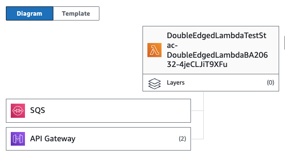

# Double Edged Lambda Construct Library Example

This is an example of an AWS CDK construct library that exposes an abstraction for an AWS Lambda
function that can be invoked either through an API Gateway or via an SQS queue (or directly).



## Usage

Import the `DoubleEdgeLambda` construct from this library and use as follows:

```ts
import { DoubleEdgedLambda } from 'double-edged-lambda';
import { App, Stack, aws_apigateway, aws_lambda } from 'aws-cdk-lib';

const app = new App();
const stack = new Stack(app, 'DoubleEdgedLambdaTestStack');

const api = new aws_apigateway.RestApi(stack, "Api");

const del = new DoubleEdgedLambda(stack, "DoubleEdgedLambda", {

  // required lambda configuration
  code: aws_lambda.Code.fromAsset("./handler"),
  runtime: aws_lambda.Runtime.NODEJS_20_X,
  handler: "index.handler",
  
  // optionally connect an API Gateway resource
  apiResource: api.root,

  // customize queue options as needed
  queueOptions: { /* ... */ }

});

// you can access the associated queue like this
const queueUrl = del.queue.queueUrl;
```

## License

Apache 2.0